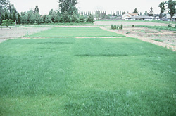

```{r setup, include=FALSE}
knitr::opts_chunk$set(echo = TRUE)
```

# Preparations

Load the necessary libraries

```{r libraries, results='markdown', eval=TRUE, warning=TRUE, message=FALSE}
library(car)       #for regression diagnostics
library(broom)     #for tidy output
library(ggfortify) #for model diagnostics
library(sjPlot)    #for outputs
library(knitr)     #for kable
library(effects)   #for partial effects plots
library(emmeans)   #for estimating marginal means
library(tidyverse) #for data wrangling
library(modelr)    #for auxillary modelling functions
```

# Scenario

Here is an example from @Fowler-1998-1998. An agriculturalist was interested in the effects of fertilizer load on the yield of grass.  Grass seed was sown uniformly over an area and different quantities of commercial fertilizer were applied to each of ten 1 m<sup>2</sup> randomly located plots.  Two months later the grass from each plot was harvested, dried and weighed.  The data are in the file **fertilizer.csv** in the **data** folder.

{width=70%}

| FERTILIZER   | YIELD   |
| ------------ | ------- |
| 25           | 84      |
| 50           | 80      |
| 75           | 90      |
| 100          | 154     |
| 125          | 148     |
| \...         | \...    |

---------------- ---------------------------------------------------
**FERTILIZER**:  Mass of fertilizer (g.m^-2^) - Predictor variable
**YIELD**:       Yield of grass (g.m^-2^) - Response variable
---------------- ---------------------------------------------------
 
 
The aim of the analysis is to investigate the relationship between fertilizer concentration and grass yield.

# Read in the data

```{r readData, results='markdown', eval=TRUE}
fert = read_csv('../data/fertilizer.csv', trim_ws=TRUE)

glimpse(fert)
head(fert)
str(fert)
```

# Exploratory data analysis

Model formula:
$$
y_i \sim{} \mathcal{N}(\mu_i, \sigma^2)\\
\mu_i = \beta_0 + \beta_1 x_i

$$
```{r}
##Exploratory data analysis - Scatter plot

ggplot(fert, aes(x=FERTILIZER, y=YIELD)) + geom_point() + geom_smooth()

ggplot(fert, aes(x=FERTILIZER, y=YIELD)) + geom_point() + geom_smooth(method='lm')

##looks reasonable, check with box plot, is it symmetrical or violin plot
ggplot(fert, aes(y=YIELD)) +geom_boxplot()

ggplot(fert, aes(y=YIELD, x=1)) + geom_violin()

##suggests normality is given
```


# Fit the model

```{r}
## Adding the one is being specific about intercept
fert.lm <- lm(YIELD~1+FERTILIZER, data=fert)
```
# Model validation # Model investigation / hypothesis testing
```{r}
attributes(fert.lm)

fert.lm$coefficients
fert.lm$residuals
summary(fert.lm)

autoplot(fert.lm, which = 1:6, ncol = 2, label.size = 3)
## residual plots: expected vs. fitted values
## Normal QQ says how much your data fits your nominated distribution
## Scale Location uses scaled residuals
## outliers have an overly influential impact, we want to detect outlierness
## Cooks distance combines residuals and leverage - Cooks distance of over 0.8 is too influential
## Residual vs. leverage is for when you have CD problems and want to figure out what its due too, residual or leverage??

influence.measures(lm(formula = YIELD ~ FERTILIZER, data = fert)) ## * flags largest CD

plot_grid(plot_model(fert.lm, type ='diag')) ## another diagnostics set

plot(allEffects(fert.lm, residuals=TRUE)) ## Partial or effects plot, its plotting the trends that the model has estimated

## other option for function above
plot_model(fert.lm, type = 'eff', show.data = TRUE)


##based on summary(fert.lm) we get a 0.8114 unit increase in yield for every unit of fertilizer, standard error is 0.8367 ## get a t value is 9.697, t-distribution centred around 0, we got ~9.7, our p-value is 1.07e-05, therefore we reject null hypothesis and can say there is an effect of fertilizer on yield. A p value should only be binary, not more important or less important. Either yes or no.
## If we would have centred our data the slope stays the same, but the y-intercept would have changed, centering the data means y-intercept is the mean.
## The R Squared value is a measure of the strength of the relationship between 0 -1 and ours is 0.9216.

##about confidence intervals
confint(fert.lm)
## If the interval does not include 0, its significant
## people advocate to include ranges of confidence intervals in your results

## function called tidy tries to give you as consistent an output of any model as it can
tidy(fert.lm, conf.int = TRUE)
tidy(fert.lm, conf.int = TRUE) %>% kable
```


```{r}

```
# Predictions
```{r, fig.cap=fert.lm}
## Y= 51.9 + 0.811 x F -> gives the predicted yield of fertilizer
## get first to values from model coefficients, now need a model matrix
newdata <- data.frame(FERTILIZER=110)
xmat <- model.matrix(~FERTILIZER, data=newdata)
coef(fert.lm) %*% t(xmat)
## example with a few different values of fertilizer
newdata <- data.frame(FERTILIZER=110:120)
xmat <- model.matrix(~FERTILIZER, data=newdata)
coef(fert.lm) %*% t(xmat)

emmeans(fert.lm, ~FERTILIZER, at=newdata)

## repeat with more representative range of values and graph
fert_grid <- fert %>% data_grid(FERTILIZER=seq_range(FERTILIZER, n=100))

newdata <- emmeans(fert.lm, ~ FERTILIZER, at=fert_grid) %>% as.data.frame

##now plot scatter, emmean is line of best fit
##just our data
ggplot(fert, aes(x= FERTILIZER, y=YIELD)) + geom_point()

## with line of best fit
ggplot(fert, aes(x= FERTILIZER, y=YIELD)) + geom_point() + geom_line(data=newdata, aes(y=emmean, x=FERTILIZER))

## no improve graph by expressing uncertainty
ggplot() + 
  geom_point(data=fert, aes(x= FERTILIZER, y=YIELD)) + 
  geom_line(data=newdata, aes(y=emmean, x=FERTILIZER)) + 
  geom_ribbon(data=newdata, aes(ymin=lower.CL, ymax=upper.CL, x=FERTILIZER), alpha=0.3) +
  theme_classic() +
  scale_y_continuous(expression(Grass~yield~(g/m^3))) +
  scale_x_continuous(expression(Fertilizer~concentration~(g/ml^-1)))

## Look up how to make a caption

```

# Summary figures

# References
 
