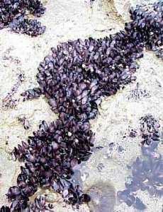

```{r setup, include=FALSE, warnings=FALSE, message=FALSE}
knitr::opts_chunk$set(echo = TRUE)
```

# Preparations

Load the necessary libraries

```{r libraries, results='markdown', eval=TRUE, message=FALSE, warning=FALSE}
library(car)       #for regression diagnostics
library(broom)     #for tidy output
library(ggfortify) #for model diagnostics
library(sjPlot)    #for outputs
library(knitr)     #for kable
library(effects)   #for partial effects plots
library(emmeans)   #for estimating marginal means
library(MASS)      #for glm.nb
library(MuMIn)     #for AICc
library(tidyverse) #for data wrangling
library(modelr)    #for auxillary modelling functions
```

# Scenario

Here is a modified example from @Peake-1993-269.  @Peake-1993-269 investigated the relationship between the number of individuals of invertebrates living in amongst clumps of mussels on a rocky intertidal shore and the area of those mussel clumps.



Format of peakquinn.csv data files

| AREA      | INDIV   |
| --------- | ------- |
| 516.00    | 18      |
| 469.06    | 60      |
| 462.25    | 57      |
| 938.60    | 100     |
| 1357.15   | 48      |
| \...      | \...    |

----------- --------------------------------------------------------------
**AREA**    Area of mussel clump mm^2^ - Predictor variable
**INDIV**   Number of individuals found within clump - Response variable
----------- --------------------------------------------------------------


The aim of the analysis is to investigate the relationship between mussel clump area and the number of non-mussel invertebrate individuals supported in the mussel clump.

# Read in the data

```{r readData, results='markdown', eval=TRUE}
peake = read_csv('../data/peakquinn.csv', trim_ws=TRUE)
glimpse(peake)
```


# Exploratory data analysis
```{bash}
##It is a count, there can only be 18 individuals not 18.4, poisson distribution is best, because it works with counts
## non-linear, fewer data points at larger areas,seems like area is some sort of skewed distribution. Not uniform, nor normally distributed, here they are skewed.
ggplot(peake, aes(x= AREA, y = INDIV)) + geom_point() + geom_smooth()

## we can plug it on a log scale
ggplot(peake, aes(x= AREA, y = INDIV)) + geom_point() + geom_smooth() + scale_x_log10() + scale_y_log10()
## linearity now looks better, do not have a consistent trend in noise as before, this now becomes a better assessement for a model we might want to fit. If we were to log our x variable and use poisson this is a reasonable representation. it satisfies our requirements, it has linearity and normality


```


Model formula:
$$
y_i \sim{} \mathcal{Pois}(\lambda_i)\\
ln(\lambda_i) = \beta_0 + \beta_1 ln(x_i)
$$


# Fit the model
```{r}
peake.glm <- glm(INDIV ~ log(AREA), data=peake, family=poisson(link='log'))
autoplot(peake.glm, which=1:6)
1-pchisq(peake.glm$deviance, peake.glm$df.resid)
## 0 
##Poisson assumes mean and variance are equal, but is count data not poisson? but how many individuals is influenced by heaps of things not just muscle clump, we are only looking at only one variable. Our model is too simplistic. We could add more covariates. Maybe add a proxy for all the other variables we could have measured?? involves mixed effects models. We can add a a variable that soaks up all the unexplained variability.
```
## Candidate models {.tabset .tabset-faded}
### LM
#### Model validation
### Poisson (GLM)
#### Model validation
Explore a lack of fit
Explore overdispersion
### Negative Binomial (GLM)
```{r}
##additional variability can be due to clustering, negative binomial is a great catch for clustering.
##Often 0 is not real, but they are due to our inability to detect them, there are more 0s than a poisson would expect. negative binominal can account for that.
#- adding a variable
#- 0 inflated models
#- negative binomial
# but need to figure out what is actually going wrong to choose another option
## We can calculate the dispersion paramater
peake.glm$deviance/peake.glm$df.resid ## This number should be 1, so deviance equals mean
## It is 67.29376, clearly over-dispersed, dispersion is greater than 3, there is a problem.
## We have few 0s so thats not a problem, and we also don't have additional variables to add, so we try negative binomial

peake.glm1 <- glm.nb(INDIV ~ log(AREA), data=peake)
autoplot(peake.glm1, which=1:6)

##goodness of fit test
1-pchisq(peake.glm1$deviance, peake.glm1$df.residual)
## 0.3036, 
##Overdispersion?: looks good too, not over-dispersed = 1.1278
peake.glm1$deviance/peake.glm1$df.residual
## Information criteria to see how good model is Akiak
AIC(peake.glm, peake.glm1)
##           df       AIC
##peake.glm   2 1738.9471
##peake.glm1  3  312.1603
## So glm1, the negative binomial is a way better fit, two units difference is important for AIC
## for small data sets you can use AICc
AICc(peake.glm, peake.glm1)
#            df      AICc
#peake.glm   2 1739.4926
#peake.glm1  3  313.3032
plot(allEffects(peake.glm1, residuals=TRUE), type='response')
## type response ensures were back on the link scale not the log scale

summary(glm1)
## These values are on a log scale
## for every unit change in log area, there is a 0.82 change of log of individuals.
## for every one unit change in log area, the number of individuals increases by a factor of 2.27 (more doubling)
## minus plus becomes x and / in log laws

## keep in mind it is all expressed on a log scale
tidy(peake.glm1, conf.int=TRUE) %>% kable

## strength of relationship
1-(peake.glm1$deviance/peake.glm1$null)
##0.838 = 84% of variability we can explain
## calculating R^2, similar as above, but function below is the accepted methodology, there is a version for mixed models too
r.squaredLR(peake.glm1)
## 0.8551296

```
# Summary figures
```{r}
peake.grid <- peake %>% data_grid(AREA=seq_range(AREA, n=100))
newdata <- emmeans(peake.glm1, ~AREA, at=peake.grid, type='response') %>% as.data.frame()
ggplot(newdata, aes(y=response, x=AREA)) + geom_ribbon(aes(ymin=asymp.LCL, ymax=asymp.UCL), fill='blue', alpha=0.3) +
  geom_line() + geom_point(data=peake, aes(y=INDIV)) + scale_x_log10() + scale_y_log10() + theme_classic() 

```


# References
