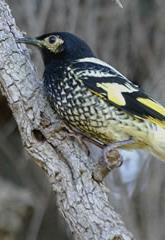

```{r setup, include=FALSE, warnings=FALSE, message=FALSE}
knitr::opts_chunk$set(echo = TRUE)
```

# Preparations

Load the necessary libraries

```{r libraries, results='markdown', eval=TRUE, message=FALSE, warning=FALSE}
library(car)       #for regression diagnostics
library(broom)     #for tidy output
library(ggfortify) #for model diagnostics
library(sjPlot)    #for outputs
library(knitr)     #for kable
library(effects)   #for partial effects plots
library(emmeans)   #for estimating marginal means
library(MASS)      #for glm.nb
library(MuMIn)     #for AICc
library(tidyverse) #for data wrangling
library(modelr)    #for auxillary modelling functions
```

# Scenario

@Loyn-1987-1987 modeled the abundance of forest birds with six predictor
variables (patch area, distance to nearest patch, distance to nearest
larger patch, grazing intensity, altitude and years since the patch had
been isolated).

{width="165" height="240"}

Format of loyn.csv data file

ABUND   DIST   LDIST   AREA   GRAZE   ALT   YR.ISOL
------- ------ ------- ------ ------- ----- ---------
..      ..     ..      ..     ..      ..    ..

------------- ------------------------------------------------------------------------------
**ABUND**     Abundance of forest birds in patch- response variable
**DIST**      Distance to nearest patch - predictor variable
**LDIST**     Distance to nearest larger patch - predictor variable
**AREA**      Size of the patch - predictor variable
**GRAZE**     Grazing intensity (1 to 5, representing light to heavy) - predictor variable
**ALT**       Altitude - predictor variable
**YR.ISOL**   Number of years since the patch was isolated - predictor variable
------------- ------------------------------------------------------------------------------

The aim of the analysis is to investigate the effects of a range of predictors on the abundance of forest birds.

# Read in the data

```{r readData, results='markdown', eval=TRUE}
loyn = read_csv('../data/loyn.csv', trim_ws=TRUE)
glimpse(loyn)
```

# Exploratory data analysis

Model formula:
$$
y_i \sim{} \mathcal{N}(\mu_i, \sigma^2)\\
\mu_i = \boldsymbol{\beta} \bf{X_i}
$$

where $\boldsymbol{\beta}$ is a vector of effects parameters and $\bf{X}$ is a model matrix representing the additive effects of
the scaled versions of distance (ln), distance to the nearest large patch (ln), patch area (ln), grazing intensity, year of isolation and 
altitude on the abundance of forest birds.
# Fit the model
```{r}
## now we have multiple predictor (multiple regression), here we have 6 partial slopes, the effect of one variable when all the others are at their average, is only representing at one stage, not all stages, partial effects
## Abundance is 5.3 birds, not 5 birds, so they are averages per plot for each patch. What distribution generates averages? A Gaussian could, if the distribution is skewed, than maybe a Gamma distribution. Averages are not going to be 0 so Gamma could be useful. Start with Gaussian: 1. Normality, homogeneous variance, linearity, multi-co-linearity (you should not have correlated predictors in the same model). Regression is not a good thing to do prediction from. The model can't decipher properly which predictors correlates to what or has what effect, they rub each other. Works though, if youre only interested in one and throw the others in to soak up variability, its fine but dont intepret values for other predictors.

scatterplotMatrix(~ABUND+DIST+LDIST+AREA+GRAZE+ALT+YR.ISOL, data=loyn, diagonal = list(method='boxplot'))

## some variables seem to express non-normality

scatterplotMatrix(~ABUND+log(DIST)+log(LDIST)+log(AREA)+GRAZE+ALT+YR.ISOL, data=loyn, diagonal = list(method='boxplot'))
## From this perspective, linearity seems alright, some trends are not that strong, for most, most points are equally noisy along the plot, no skew of noise. What about co-linearity? Any trends between pairs of predictors? maybe
## We should center our predictors, the intercept makes sense and its computationally more effective. This makes sense when you have multiple predictors. All predictors are on a different scale, slope is affected by scale (mm^2 vs. hectar e.g.). If you want to make assumptions about effect of each predictors they need to be on the same scale, the slopes have to be calculated from the same scale data. We should therefore centre the data, and scale each predictor so they all have same standard deviation. Especially important later for Bayesian. You must scale after logging, you cannot log a negative number.

## Mutate data set by adding a categorial variable of Grazing
loyn <- loyn %>% mutate(fGRAZE=factor(GRAZE))

loyn.lm <- lm(ABUND ~ scale(log(DIST)) + scale(log(LDIST)) + scale(log(AREA)) + fGRAZE + scale(ALT) + scale(YR.ISOL), data =loyn)

```

# Model validation
# Model investigation / hypothesis testing
# Predictions {.tabset .tabset-faded}
## Option 1 - dredge
## Option 2 - model averaging
## Option 3 - explore a small set of models
```{r}
autoplot(loyn.lm, which=1:6)

## This addresses our assumptions but what about co-linearity?
## check 
vif(loyn.lm)
## 1- 1/R^2 is variance inflation, you want these values under 3, but under 5 is ok as well (0.8 of R^2)
## You only get categorical variables you get the last column added. We use that one, therefore we can keep all variables, no massive co-linearity. Only area seems to make a big difference, grazing only beyond a level of 4, others have smaller effects but that does not mean they do not contribute to the model

summary(loyn.lm)

## coeffiecient estimates how that area and grazing level 5 has big impacts on bird abundance
## categorial treated in a way saying that grazing level 2,3,4 are not much different than grazing level 1 but 5 is.
plot(allEffects(loyn.lm, residuals=TRUE), type='response')
## since we centred intercept has a meaning. So 22.47 is number of birds (intercept), grazing level 5 says that it has -12 (12 less) birds per plot, area says it has on average 5.5 more birds than average

## Can do dredging to see if we need all 6 variables. run every model possible taking one variable out at each time, then do AIK and see whats lowest value that model is best (but not best approach)
## this fails a model if data has missing values
loyn.lm <- update(loyn.lm, na.action=na.fail)

## then dredge
dredge(loyn.lm, rank="AICc")

##However better is apriori proposing model by theme (distance, grazing, connectivity, climate) and include variables related to the topic. Which models tell me something about the system
## Lets fit one simply about connectivity

loyn.lm1 <- update(loyn.lm, .~scale(log(DIST)) + scale(log(LDIST)))
## dot means keep everything before, in this case abundance

## lets fit one simply about the features of the area and more (you can also keep a variable you know is important but want to test others, to standardize) # making such categories is good cause it is ecologically sensible and supports data

loyn.lm2 <- update(loyn.lm, .~scale(log(AREA)) + fGRAZE + scale(YR.ISOL))

loyn.lm3 <- update(loyn.lm, .~scale(log(AREA)) + fGRAZE)

loyn.lm4 <- update(loyn.lm, .~scale(ALT))

loyn.null <- update(loyn.lm, .~1) ## null model just gives average

## Now get AICc for all

AICc(loyn.lm, loyn.lm1, loyn.lm2, loyn.lm3, loyn.lm4, loyn.null)

#         df     AICc
#loyn.lm   11 378.5242
#loyn.lm1   4 431.4651
#loyn.lm2   8 369.9988
#loyn.lm3   7 367.3767
#loyn.lm4   3 421.1775
#loyn.null  2 427.9690

#only some models fit
```
# Summary figures
```{r}
## no need for type=response, because with gaussian its 1
newdata <- list(fGRAZE=levels(loyn$fGRAZE), AREA=seq_range(loyn$AREA, n=100))

newdata <- emmeans(loyn.lm3, ~AREA|fGRAZE, at=newdata) %>% as.data.frame()

ggplot(newdata, aes(y=emmean, x=AREA, color=fGRAZE, fill=fGRAZE)) + geom_ribbon(aes(ymin=lower.CL, ymax=upper.CL), color=NA, alpha=0.3) + geom_line() + scale_x_log10(labels=scales::comma)+ scale_y_continuous('Abundance') + theme_classic()

## plot show negative abundance, that makes no sense, Gaussian does not allow negative distribution! Better would have been GAMMA.

## correct with GAMMA, use area and grazing model
## Need to clarify when to scale with log - we do this cause area wasnt normal and predictors all need to be normal
##problems with 0, sometimes just make to 0.00001 

##model with an interaction
loyn.glm <- glm(ABUND~scale(log(AREA)) * fGRAZE, data=loyn, family=Gamma(link='log'))

## additive model which assumes an interaction
loyn.glm1 <- glm(ABUND~scale(log(AREA)) + fGRAZE, data=loyn, family=Gamma(link='log'))

##Which one is better? AIC

AICc(loyn.glm, loyn.glm1)

          #df     AICc
#loyn.glm  11 391.4837
#loyn.glm1  7 393.3003
#Both the same, so go with simplest with less df

summary(loyn.glm1)
#Intercept 2.95324, gotta take exponent as everything in the table is on log scale
exp(2.95324)
##19.16796

newdata <- list(fGRAZE=levels(loyn$fGRAZE), AREA=seq_range(loyn$AREA, n=100))

newdata <- emmeans(loyn.glm1, ~AREA|fGRAZE, at=newdata, type='response') %>% as.data.frame()

ggplot(newdata, aes(y=response, x=AREA, color=fGRAZE, fill=fGRAZE)) + geom_ribbon(aes(ymin=asymp.LCL, ymax=asymp.UCL), color=NA, alpha=0.3) + geom_line() + scale_x_log10(labels=scales::comma)+ scale_y_continuous('Abundance') + theme_classic()


```


# Further/alternative analyses


# References
