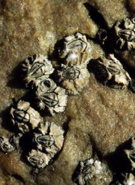

```{r setup, include=FALSE, warnings=FALSE, message=FALSE}
knitr::opts_chunk$set(echo = TRUE)
```

# Preparations

Load the necessary libraries

```{r libraries, results='markdown', eval=TRUE, message=FALSE, warning=FALSE}
library(car)       #for regression diagnostics
library(broom)     #for tidy output
library(ggfortify) #for model diagnostics
library(sjPlot)    #for outputs
library(knitr)     #for kable
library(effects)   #for partial effects plots
library(emmeans)   #for estimating marginal means
library(MASS)      #for glm.nb
library(MuMIn)     #for AICc
library(tidyverse) #for data wrangling
library(modelr)    #for auxillary modelling functions
```

# Scenario

Here is a modified example from @Quinn-2002-2002. Day and Quinn
(1989) described an experiment that examined how rock surface type
affected the recruitment of barnacles to a rocky shore. The experiment
had a single factor, surface type, with 4 treatments or levels: algal
species 1 (ALG1), algal species 2 (ALG2), naturally bare surfaces (NB)
and artificially scraped bare surfaces (S). There were 5 replicate plots
for each surface type and the response (dependent) variable was the
number of newly recruited barnacles on each plot after 4 weeks.

{width="224" height="308"}

Format of day.csv data files

TREAT   BARNACLE
------- ----------
ALG1    27
..      ..
ALG2    24
..      ..
NB      9
..      ..
S       12
..      ..

-------------- ----------------------------------------------------------------------------------------------------------------------------------------------
**TREAT**      Categorical listing of surface types. ALG1 = algal species 1, ALG2 = algal species 2, NB = naturally bare surface, S = scraped bare surface.
**BARNACLE**   The number of newly recruited barnacles on each plot after 4 weeks.
-------------- ----------------------------------------------------------------------------------------------------------------------------------------------

# Read in the data

```{r readData, results='markdown', eval=TRUE}
day = read_csv('../data/day.csv', trim_ws=TRUE)
glimpse(day)
```


# Exploratory data analysis

Model formula:
$$
y_i \sim{} \mathcal{Pois}(\lambda_i)\\
\mu_i = \boldsymbol{\beta} \bf{X_i}
$$

where $\boldsymbol{\beta}$ is a vector of effects parameters and $\bf{X}$ is a model matrix representing the intercept and treatment contrasts for the effects of Treatment on barnacle recruitment.


# Exploratory data analysis # Fit the model # Model validation 
## Gaussian
## Poisson
# Model investigation / hypothesis testing 
## Gaussian
## Poisson
# Predictions
## Post-hoc test (Tukey's)
## Planned contrasts
Define your own Compare:
a) ALG1 vs ALG2
b) NB vs S
c) average of ALG1+ALG2 vs NB+S

```{r}

ggplot(day, aes(y=BARNACLE, x=TREAT)) + geom_boxplot() + geom_point(color='red')

## Fit a poisson for this count data, after looking at box plots

day.glm <- glm(BARNACLE~TREAT, data=day, family='gaussian')
day.glm1 <- glm(BARNACLE~TREAT, data=day, family='poisson')

autoplot(day.glm1, which=1:6)
## Cooks d / leverage makes no sense for categorical data, cannot be outlier on x axis

##Goodness of fit test
1-pchisq(day.glm1$deviance, day.glm1$df.residual)
## 0.3719059 no lack of fit, p value greater than 0.05

##dispersion parameter, should be close to 1 if our variance and mean are equal
day.glm1$deviance/day.glm1$df.residual
## 1.075851

## Just as a comparison we look at the Gaussian model, requirews no backtransformation (WOULDNT usually do this)
plot(allEffects(day.glm))
summary(day.glm)
## First group is now intercept, and estimates show differences to first group (in this ALgae 1)
## Compare with p value

##Now we do the same with the Poisson, back to it
plot(allEffects(day.glm1))
summary(day.glm1)
## this one shows on a log scale the difference to group 1 (intercept) for the other groups, gotta exp.
exp(3.109)
## 22.39863
## group 2 is 0.23733,
exp(0.23733)
## is 1.267859, this is a multiplier, ~27% more!! = 28.5

## to see how all the other groups differ with respect to each other and not just one, we need to perform a post-hoc test
## Tukeys, Bonferoni tests, constraints the family wise error rate at 0.05, so error rate across all tests intend to do stays 0.05

emmeans(day.glm1, pairwise ~ TREAT, type='response') # by default a tukeys test with adjustments for error rates
## P values are not the same because we adjusted for multiple comparisons
# contrast    ratio     SE  df z.ratio p.value
# ALG1 / ALG2 0.789 0.0997 Inf -1.878  0.2375 
 #ALG1 / NB   1.493 0.2228 Inf  2.688  0.0362 
 #ALG1 / S    1.697 0.2633 Inf  3.408  0.0037 
 #ALG2 / NB   1.893 0.2703 Inf  4.472  <.0001 
 #ALG2 / S    2.152 0.3205 Inf  5.143  <.0001 
 #
#NB / S      1.136 0.1918 Inf  0.757  0.8735 

## What if we do not care about all comparisons because they are too expensive in terms of loosing power
## We have 4 variables, ALG1,ALG2,NB,S....in the original model we had intercept and 3 slopes, we could re-parameterize the model. Contrast matrix to only compare alg1 and alg2 to see how they interact, leaving out nb and s. Then compare the bare ones, naturally bare and scraped. Then compare algae was no algae as two combined groups. Dont define more parameters than P-1. The comparisons that we make need to be independent.

cmat<-(cbind('Alg1_Alg2'=c(1,-1,0,0), 'NB_S'=c(0,0,1,-1), 'Alg_Bare'=c(0.5,0.5,-0.5,-0.5)))

# make sure comparisons are indepdenent, grid only important with continous data

crossprod(cmat)

emmeans(day.glm1, ~ TREAT, contr=list(TREAT=cmat), type='response')

newdata <- emmeans(day.glm1, ~TREAT, type='response') %>% as.data.frame()

ggplot(newdata, aes(y=rate, x=TREAT)) + geom_pointrange(aes(ymin=asymp.LCL, ymax=asymp.UCL))  +geom_point() + scale_x_discrete('Treatment', breaks=c('ALG1', 'ALG2', 'NB', 'S'), labels=c('Algae spp 1', 'Algae spp 2', 'Naturally bare', 'Scraped bare')) + theme_classic()
```


# Summary figures


# References
