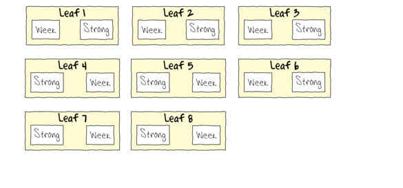

```{r setup, include=FALSE, warnings=FALSE, message=FALSE}
knitr::opts_chunk$set(echo = TRUE)
```

# Preparations

Load the necessary libraries

```{r libraries, results='markdown', eval=TRUE, message=FALSE, warning=FALSE}
library(car)       #for regression diagnostics
library(broom)     #for tidy output
library(broom.mixed)
library(ggfortify) #for model diagnostics
library(sjPlot)    #for outputs
library(knitr)     #for kable
library(effects)   #for partial effects plots
library(emmeans)   #for estimating marginal means
library(MASS)      #for glm.nb
library(MuMIn)     #for AICc
library(tidyverse) #for data wrangling
library(nlme)
library(lme4)      #for lmer
library(lmerTest)  #for satterthwaite p-values with lmer
#library(pbkrtest)  #for kenward-roger p-values with lmer
```

# Scenario

A plant pathologist wanted to examine the effects of two different strengths of tobacco virus on the number of lesions on tobacco leaves.  She knew from pilot studies that leaves were inherently very variable in response to the virus.  In an attempt to account for this leaf to leaf variability, both treatments were applied to each leaf.  Eight individual leaves were divided in half, with half of each leaf inoculated with weak strength virus and the other half inoculated with strong virus.  So the leaves were blocks and each treatment was represented once in each block.  A completely randomised design would have had 16 leaves, with 8 whole leaves randomly allocated to each treatment.  

{height="300"}



Format of tobacco.csv data files

LEAF   TREAT    NUMBER
------ -------- --------
1      Strong   35.898
1      Week     25.02
2      Strong   34.118
2      Week     23.167
3      Strong   35.702
3      Week     24.122
\...   \...     \...

------------ ----------------------------------------------------------------------------------------------------
**LEAF**     The blocking factor - Factor B
**TREAT**    Categorical representation of the strength of the tobacco virus - main factor of interest Factor A
**NUMBER**   Number of lesions on that part of the tobacco leaf - response variable
------------ ----------------------------------------------------------------------------------------------------


# Read in the data

```{r readData, results='markdown', eval=TRUE}
tobacco = read_csv('../data/tobacco.csv', trim_ws=TRUE)
glimpse(tobacco)
```


# Exploratory data analysis
```{r}
## Want categorical data as categorical
tobacco <- tobacco %>% mutate(LEAF=factor(LEAF), TREATMENT=factor(TREATMENT))

ggplot(tobacco, aes(y=NUMBER, x=TREATMENT)) + geom_boxplot()

##What distribution do we have? Being the number datas are averages, a Gaussian could work, but so could GAMMA.
## It looks like a Gaussian could work, so we try that as a linear mixed effects model.
## Another plot - interaction plot

ggplot(tobacco, aes(y=NUMBER, x = as.numeric(LEAF))) + geom_line(aes(linetype=TREATMENT))
## did leaf as.numeric, because you cannot draw a line between categories
##Generalized means other distributions besides gaussian


```

Model formula:
$$
y_i \sim{} \mathcal{N}(\mu_i, \sigma^2)\\
\mu_i =\boldsymbol{\beta} \bf{X_i} + \boldsymbol{\gamma} \bf{Z_i}
$$

where $\boldsymbol{\beta}$ and $\boldsymbol{\gamma}$ are vectors of the fixed and random effects parameters respectively 
and $\bf{X}$ is the  model matrix representing the overall intercept and effects of the treatment on the number of lesions.
$\bf{Z}$ represents a cell means model matrix for the random intercepts associated with leaves.

# Fit the model (lme)
```{r}
tobacco.lmer <- lmer(NUMBER ~ TREATMENT + (1|LEAF), data=tobacco, REML=TRUE) ## alternative

tobacco.glmmTMB <- glmmTMB(NUMBER ~ TREATMENT + (1|LEAF), data=tobacco, REML=TRUE) 

## gives an error message (hook might be faulty), but model output is there
## Random effects are defined as whats between the brackets, what does a 1 one in a model stand for? intercept, Bar means conditional on, the intercept should be conditional on the leave. That means each leaf has its own intercept. Model is going to tell us the variance in the intercepts.
##REML = TRUE, we are using maximum likelyhood, as this departs from simple gaussian. Maximum likelyhood is known to be biased. We use restricted maximum likelyhood, which is not so biased. Its maximizing the likelyhood of the residuals.
#If you want to compare models that only differ in their fixed factors, then you can only do use using maximum likelyhood. We only have one fixed effect in this model, so nothing to compare to.
## Autoplot does not support glmmTMB yet. We can use this one instead

plot_grid(plot_model(tobacco.glmmTMB, type="diag")[-2])
## -2 means do not include the second graph, its a bug, so it can run properly
## first plot is qqnormal plot, looks ok, then a pink distribution of residuals. vs. expected from normal distribution, looks pretty good. then a residual plot at bottom left (random scatter is good), little woblle is ok for small data set
## Cant be overdispersed, was Gaussian.
## No autocorrelation if only two levels to a factor, you need at least 3 things.

summary(tobacco.glmmTMB)
## How varied are the leaves, how varied for the intercepts for each leaf? 13.63 units of variance and 3.692 units of Std. Dev....compare it to residuals(noise), we can see that there is as much noise between leaves as there is within the treatments. Only looking at both gives insights/reference. Intercept: On average 34.9 lesions, and the WEAK group has 7.879 fewer, and it is significant. Was on identity scale (no log, or scaled). 

tidy(tobacco.glmmTMB, conf.int = TRUE) %>% kable

## Want an R^2 value
r.squaredGLMM(tobacco.glmmTMB)

#         R2m       R2c
#lira[1,] 0.3707882 0.6761025

## Why do we have two r values? R2m is the marginal R^2, just associated with fixed effects. Treatment alone accounts for 37% of the variability. R2c is the conditional R^2, is the fixed and conditional effects together. the model as a whole explains 68% of the variability. If you add fixed and random together, that's what it is.

## Make a plot, no need for a grid, we only got categorical data

emmeans(tobacco.glmmTMB, ~TREATMENT) %>% as.data.frame() %>% ggplot() + geom_pointrange(aes(y=emmean, x=TREATMENT, ymin=lower.CL, ymax=upper.CL))


```


# Model validation (lme)
# Model investigation / hypothesis testing
# Predictions

# Summary figures

# Fit the model (lmer)

# Fit the model (glmmTMB)

# References
